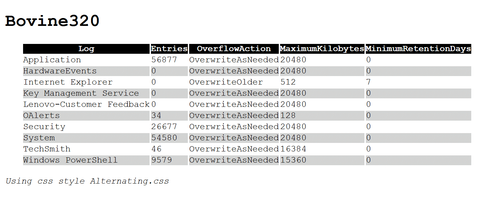
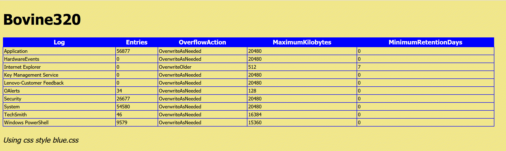
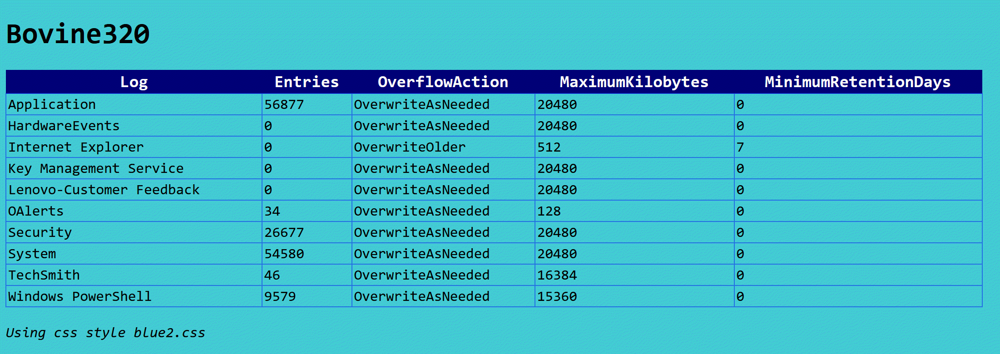
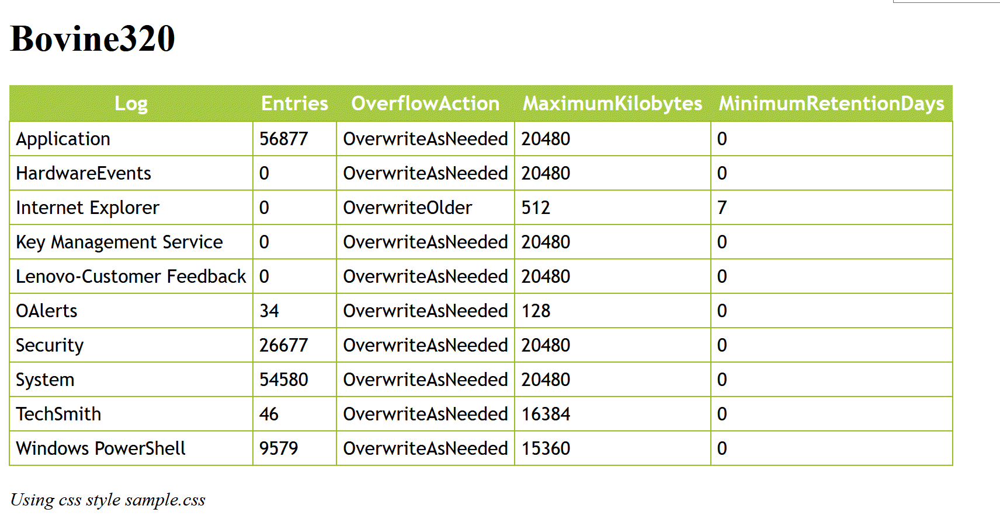
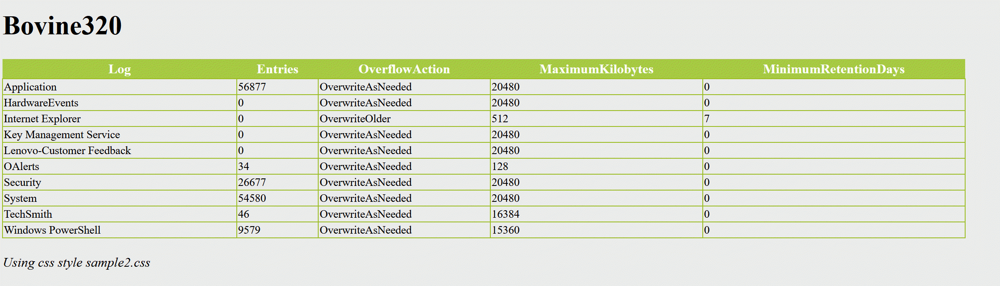
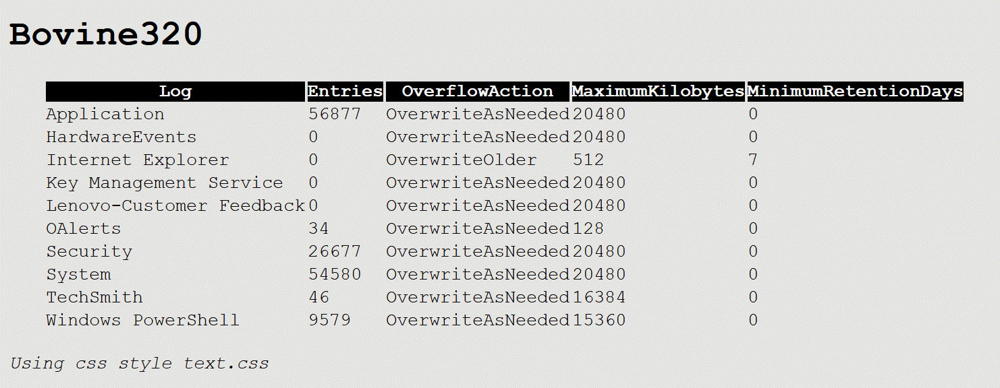

# Sample CSS Files for PowerShell HTML Reports

This is a collection of sample and demo CSS files intended for use with PowerShell scripts that use `ConvertTo-HTML`. See [SystemReport.ps1](demos/SystemReport.ps1) for an example.

You are welcome to download or fork this repository. You can't use the raw CSS files directly from GitHub.

## [Demo-Alternating.html](./demos/demo-Alternating.html)

## [Demo-Blue.html](./demos/demo-blue.html)

## [Demo-Blue2.html](./demos/demo-blue2.html)

## [Demo-Sample.html](./demos/demo-sample.html)

## [Demo-Sample2.html](./demos/demo-sample2.html)

## [Demo-Text.html](./demos/demo-text.html)

